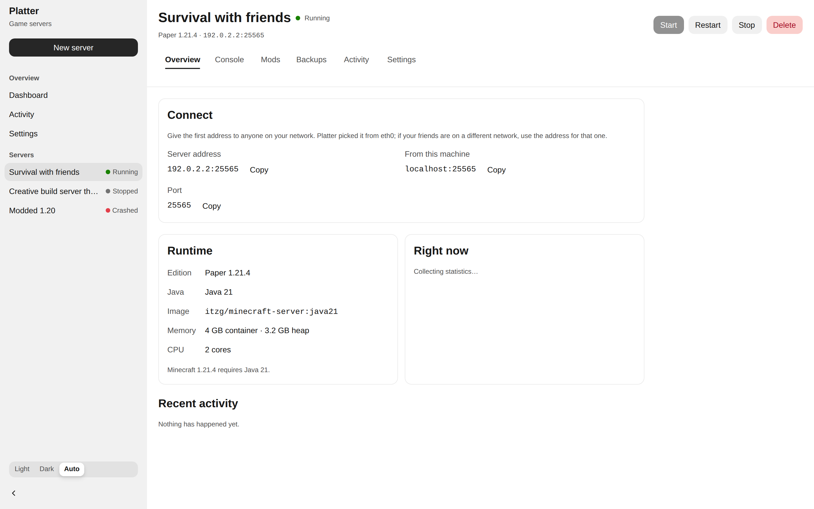

# Platter

**Simple, clean, easily deployable game servers driven by AI.**

Platter runs Minecraft servers in Docker on your own machine. Pick a version, click create, share
the address. It picks the right Java version, sizes the JVM heap, allocates a port, and hands you
something your friends can join.

It also ships an MCP server, so an AI assistant can search and curate mods, check whether they'll
actually work on *your* server, read the logs when something breaks, and propose a fix — while
every change that matters waits for you to say yes.



---

## Why another panel

PufferPanel, Pterodactyl and Crafty are all good. Having used them, four things kept coming up:

| | Everyone else | Platter |
| --- | --- | --- |
| **Java version** | You pick it. Pick wrong and the server dies with `UnsupportedClassVersionError: class file version 65.0`. | Derived from the Minecraft version — including the 1.16.5-needs-Java-16 and Forge-below-1.18-needs-Java-8 exceptions, and Java 25 for the 26.x line. You are never asked. |
| **Backups** | Stop the server first. Crafty's own docs warn that compressing a live world "can lead to chunk corruption". | Snapshot a **running** world: `save-off`, `save-all flush`, archive, `save-on`. Nobody gets disconnected, no chunk is caught half-written. |
| **Restore** | PufferPanel's restore "deletes all files", no undo. | Extracts to a staging directory and swaps in, so a failed restore leaves your world untouched. Takes a safety copy first. |
| **RCON** | An afterthought, or absent. Console is log-scraping. | A first-class second channel. Survives a wedged console, gives structured request/response, and is what makes hot backups possible. |

And the one nobody has: an AI that can actually *do* the mod research, with a human holding the
approval.

## Requirements

- Docker Engine 24+ (Docker Desktop, OrbStack, Colima and Rancher Desktop all work)
- Node.js 22.12+ and pnpm 10 — only if you're running from source

## Run it

**Docker (recommended):**

```bash
git clone https://github.com/thekozugroup/Platter.git
cd Platter
docker compose -f docker/compose.yaml up -d
```

Open <http://localhost:4880>.

**From source:**

```bash
pnpm install
pnpm dev
```

That's the whole setup. There is no database to provision, no config file to fill in, no
migration step to remember — Platter creates `~/.platter`, migrates on boot, and starts.

## What you get

- **Servers in a click.** Vanilla, Paper, Purpur, Spigot, Folia, Fabric, Forge, NeoForge and
  Quilt. Platter tells you which loaders exist for the version you picked, and why.
- **A live console** with real RCON. Command history, structured responses, and output that keeps
  streaming when the server is unhealthy.
- **Hot backups** on a schedule, with retention. Restore is one click and reversible.
- **Mod management** across Modrinth and CurseForge, with a compatibility engine that resolves an
  actual downloadable file — not a project's historical support union, which is where every
  "compatible" mod that isn't comes from.
- **Diagnosis.** When a server crashes, Platter reads the log and tells you what happened in
  words, with fixes it can apply.
- **An audit trail** covering everything, with AI-initiated actions tagged and linked to the
  proposal a human approved.

## The AI part

Platter's MCP server exposes all of the above to an AI assistant.

**Claude Code:**

```bash
claude mcp add platter -- npx -y @platter/mcp
```

**Claude Desktop / Cursor** — add to your MCP config:

```json
{
  "mcpServers": {
    "platter": {
      "command": "npx",
      "args": ["-y", "@platter/mcp"]
    }
  }
}
```

Then ask for what you want:

> *"My Fabric server is crashing on startup. What's wrong?"*
>
> *"Find me some performance mods that'll work on it, and check them against what's already
> installed."*
>
> *"Roll back to before I added that mod."*

### Nothing happens without you

Reading is free — an assistant can list servers, tail logs, search mods and run a diagnosis
without asking. Anything that *changes* a server goes through a confirmation prompt in your
client showing exactly what will change:

```
Install Lithium 0.14.3 and Ferritecore 7.0.2 on Survival?

• Lithium 0.14.3
• FerriteCore 7.0.2

Plus these required dependencies:
• Fabric API 0.115.0

Total download: 2.4 MB.
Files go in /data/mods.
Platter backs the server up first, and the server needs a restart to load them.
```

There is no auto-approve flag. Declining and dismissing are treated the same. Every proposal —
approved or not — is recorded with the model's reasoning and the compatibility report that
justified it.

## How it works

```
apps/web            Next.js UI, built on Meta's Astryx design system
apps/mcp            MCP server (stdio + authenticated HTTP)
packages/core       Docker orchestration, RCON, backups, the supervisor
packages/db         SQLite schema and migrations (Drizzle)
packages/mods       Modrinth + CurseForge clients, compatibility engine
packages/diagnostics Log parsing and the diagnosis rule catalogue
packages/shared     Domain types, config, Result, logging
```

A few decisions worth knowing about:

**Docker is the source of truth for reality; the database records intent.** A supervisor
reconciles them every few seconds, so a container you stopped by hand, a crash while Platter was
closed, or a reboot all show up correctly instead of leaving a stale "Running" badge.

**Every destructive Docker call is gated on a label.** Platter only touches containers carrying
`platter.managed=true`. A bug in Platter cannot reap your unrelated containers.

**Game containers are hardened by default** — capabilities dropped, `no-new-privileges`,
mandatory memory/CPU/pids caps, swap disabled, capped log files, non-root, on a dedicated bridge
network. A runaway mod cannot take the host down or reach your other containers.

**Minecraft versions are never parsed.** They moved to calendar versioning (`26.1`, `26.2`) and no
comparator over the strings sorts `1.21.11` and `26.1` correctly. Ordering comes from Modrinth's
version index, by position.

See [SECURITY.md](./SECURITY.md) for the threat model, and what mounting the Docker socket
actually means.

## Configuration

Everything has a working default. The ones you might want:

| Variable | Default | What it does |
| --- | --- | --- |
| `PLATTER_DATA_DIR` | `~/.platter` | Database, worlds, backups, mod cache. Back this up. |
| `PLATTER_HOST` | `127.0.0.1` | Bind address. Anything non-loopback **requires** `PLATTER_AUTH_TOKEN`. |
| `PLATTER_PORT` | `4880` | UI port. |
| `PLATTER_PORT_RANGE_START/END` | `25565`–`25664` | Ports handed out to game servers. |
| `MODRINTH_TOKEN` | — | Optional. Raises the rate limit. |
| `CURSEFORGE_API_KEY` | — | Without it, CurseForge is hidden rather than failing. |
| `PLATTER_ALLOWED_HOSTS` | — | Comma-separated DNS names the UI answers to. IP addresses always work; a name has to be listed. Set this if you reach Platter as `platter.lan` or through a reverse proxy. |
| `PLATTER_MINECRAFT_IMAGE_REPO` | `itzg/minecraft-server` | Point at a private mirror or air-gapped registry. |

Full list with explanations: [`packages/shared/src/env.ts`](./packages/shared/src/env.ts).

## Testing

```bash
pnpm check    # lint + typecheck + unit tests
pnpm smoke    # creates a real server in Docker, boots it, hot-backs-up, restores, tears down
```

`pnpm smoke` is the one that matters. It catches the things unit tests structurally cannot — a
wrong environment variable, a bad port binding, a hardening flag the image rejects, a backup that
produces an unreadable archive.

## Contributing

See [CONTRIBUTING.md](./CONTRIBUTING.md). Adding a game shouldn't require touching the
orchestrator; adding a diagnosis rule needs a real log excerpt, not an invented one.

## Credits

Design inspired by [ghost](https://github.com/haydenbleasel/ghost); feature set informed by
[PufferPanel](https://github.com/PufferPanel/PufferPanel). Game servers run on
[itzg/docker-minecraft-server](https://github.com/itzg/docker-minecraft-server), which is
excellent and does the genuinely hard part. UI built with
[Astryx](https://astryx.atmeta.com/).

## Licence

MIT — see [LICENSE](./LICENSE).

Minecraft is a trademark of Mojang Synergies AB. Platter is not affiliated with or endorsed by
Mojang or Microsoft. Running a server requires accepting the
[Minecraft EULA](https://aka.ms/MinecraftEULA).
